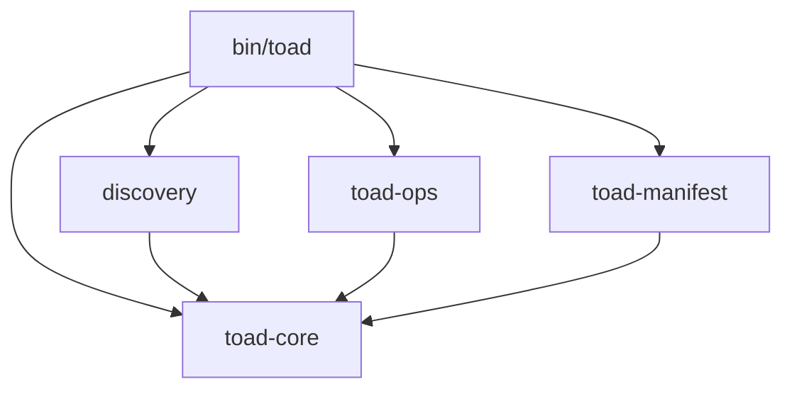

# Rust in Primatif Toad

## Introduction

Welcome to the architectural guide for **Primatif Toad**. This document is
designed to help experienced Rust developers understand the specific patterns,
structural decisions, and "local idioms" that drive this modular CLI workspace.

Toad is not just a binary; it is a **meta-engineering platform** composed of
decoupled crates, each with a specific responsibility. This guide will walk you
through the workspace structure, the core data models, and the extensibility
patterns that allow Toad to manage hundreds of projects with sub-second latency.

## Workspace Orchestration

The project is organized as a Cargo Workspace, ensuring that logic is strictly
separated by concern. This prevents the "monolithic binary" anti-pattern and
allows for easier testing and refactoring.

### Crate Roles

- **`bin/toad`**: The **Interface Layer**. This crate contains the `clap` CLI
  definition, argument parsing, and high-level command delegation. It contains
  _no_ business logic—it simply parses user intent and dispatches it to the
  appropriate crate.
- **`crates/toad-core`**: The **Source of Truth**. This is the only crate that
  defines the shared data models (`ProjectDetail`, `StackStrategy`,
  `ActivityTier`), global configuration, and the persistence layer (registries).
  All other crates depend on `toad-core`.
- **`crates/discovery`**: The **Strategy Engine**. This crate is responsible for
  scanning the filesystem, identifying project types using the `StackStrategy`
  manifests, and populating the taxonomy.
- **`crates/toad-ops`**: The **Execution Engine**. This crate handles "side
  effects"—shell command execution, git operations (via sub-crate or direct
  calls), disk cleaning, and audit logging. If it touches the disk or runs a
  process, it lives here.
- **`crates/toad-manifest`**: The **Context Generator**. A specialized crate
  dedicated to generating the high-fidelity `MANIFEST.md` shadow context for AI
  agents.
- **`crates/scaffold`**: The **Generator**. Handles `toad create` logic and
  template instantiation.

### Dependency Graph

The architecture enforces a strict DAG (Directed Acyclic Graph):



## CLI Architecture

Toad uses a **Delegation Pattern** to keep the binary small and focused. The
`bin/toad` crate is purely an interface adapter. It parses arguments using
`clap` and then delegates the actual work to a specialized library crate.

### The Delegation Pattern

The `main` function essentially acts as a router. It initializes the workspace
context and then switches on the subcommand.

```rust
// bin/toad/src/main.rs

match &cli.command {
    Commands::Create { name, dry_run } => {
        // ... config setup ...
        // Delegation: Calling the 'scaffold' crate
        scaffold::create_project(config)?; 
    }
    Commands::Reveal { query, tag } => {
        // ...
        // Delegation: Calling the 'discovery' crate
        let projects = discovery::scan_all_projects(&workspace)?;
        // ...
    }
    // ...
}
```

### Why this matters

1. **Testability:** Because the logic is in library crates (`scaffold`,
   `discovery`), we can write unit and integration tests for them without
   spawning a subprocess to run the binary.
2. **Reusability:** Other tools (e.g., a GUI or a web server) could import
   `toad-core` and `discovery` to build a totally different interface on top of
   the same logic.
3. **Compilation Speed:** Changes to `toad-ops` don't force a recompile of
   `discovery`, speeding up the dev loop.

## Core Data Models

The heart of the system is `crates/toad-core`. This crate defines the canonical
types used across the ecosystem.

### `ProjectDetail`

This struct represents the "atom" of the Toad universe. It contains everything
we know about a project.

```rust
// crates/toad-core/src/lib.rs

pub struct ProjectDetail {
    pub name: String,
    pub path: PathBuf,
    pub stack: String,          // e.g., "Rust", "NodeJS"
    pub activity: ActivityTier, // Active, Cold, Archive
    pub vcs_status: VcsStatus,  // Clean, Dirty, Untracked
    pub taxonomy: Vec<String>,  // e.g., ["#rust", "#cli", "#backend"]
    // ...
}
```

### `StackStrategy`

Toad uses a data-driven approach to identify projects. Instead of hardcoded `if`
statements, it uses `StackStrategy` structs loaded from TOML files.

```rust
// crates/toad-core/src/lib.rs

pub struct StackStrategy {
    pub name: String,
    pub match_files: Vec<String>, // e.g., ["Cargo.toml"]
    pub artifacts: Vec<String>,   // e.g., ["target"]
    pub tags: Vec<String>,        // e.g., ["#rust"]
    pub priority: i32,
}
```

## Strategy Pattern & Extensibility

Toad's power comes from its ability to learn new languages without recompiling.
This is achieved through the **Dynamic Strategy Engine**.

### The Strategy Registry

The `discovery` crate loads strategies from `~/.toad/strategies/` at runtime.

1. **Scanning:** When `scan_all_projects` runs, it iterates through every
   directory.
2. **Matching:** For each directory, it checks if the files match any active
   `StackStrategy`.
3. **Aggregation:** A project can match _multiple_ strategies (e.g., a Rust
   project wrapped in Docker). The tags and cleaning artifacts are aggregated
   into a single `ProjectDetail`.

## Operational Logic

The `toad-ops` crate is where the "rubber meets the road." It handles
potentially destructive operations and system interactions.

### Stats & Hygiene

The `stats` module calculates disk usage but separates "Source Code" from "Build
Artifacts" using the data provided by the Strategy Engine.

```rust
// crates/toad-ops/src/stats.rs

pub fn calculate_project_stats(path: &Path, artifact_dirs: &HashSet<&str>) -> ProjectStats {
    // ... walks the directory ...
    // If a file is inside an artifact_dir (e.g., "node_modules"), it counts as 'artifact_bytes'.
    // Otherwise, it counts as 'source_bytes'.
}
```

This distinction allows `toad clean` to surgically remove bloat without touching
code.
